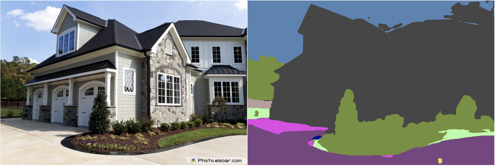

# DSL-FR: A Domain Specific Language for Flooding Resilience

DSL-FR is a programming language designed to bridge the gap between domain scientists and programmers, make it easier to write high readability code for image processing tasks. 

